This page describes how `MerkleLayer` generates and verifies a Merkle proof for a single state transition over the MAVL tree. AVL rebalancing makes this harder than the analogous problem for an unbalanced trie: a single `set` or `delete` can rotate nodes the operation never directly touched. The proof has to describe the **initial** tree shape — but the verifier has to apply the operation, which produces the **post-step** shape on its end. The two structures diverge.

This page explains the architecture introduced to handle that divergence and walks through four representative operations end-to-end.

Throughout the document, tree nodes are drawn with the following colour scheme:

<div style={{display: "flex", gap: "1.5rem", alignItems: "center", flexWrap: "wrap", margin: "1rem 0"}}>
  <span style={{display: "inline-flex", alignItems: "center", gap: "0.5rem"}}>
    <span style={{width: "1.25rem", height: "1.25rem", borderRadius: "50%", background: "#d4edda", border: "2px solid #1f883d", display: "inline-block", flexShrink: 0}}></span>
    accessed
  </span>
  <span style={{display: "inline-flex", alignItems: "center", gap: "0.5rem"}}>
    <span style={{width: "1.25rem", height: "1.25rem", borderRadius: "50%", background: "#f6f8fa", border: "2px solid #57606a", display: "inline-block", flexShrink: 0}}></span>
    untouched
  </span>
  <span style={{display: "inline-flex", alignItems: "center", gap: "0.5rem"}}>
    <span style={{width: "1.25rem", height: "1.25rem", borderRadius: "50%", background: "#cfe7ff", border: "2px solid #0969da", display: "inline-block", flexShrink: 0}}></span>
    new
  </span>
  <span style={{display: "inline-flex", alignItems: "center", gap: "0.5rem"}}>
    <span style={{width: "1.25rem", height: "1.25rem", borderRadius: "50%", background: "#ffe7e7", border: "2px dashed #cf222e", display: "inline-block", flexShrink: 0}}></span>
    deleted / unlinked
  </span>
</div>

Tree edges always run from parent to child, with the left child declared first. Empty subtrees are simply omitted.

## The problem

Consider a MAVL tree holding keys K1, K3, K4, K5, K6. Each node stores a balance factor (`bf`), defined per `node.rs:48-51` as `height(right) - height(left)`, with `height(empty) = -1`. AVL rebalance triggers when `|bf| = 2`.

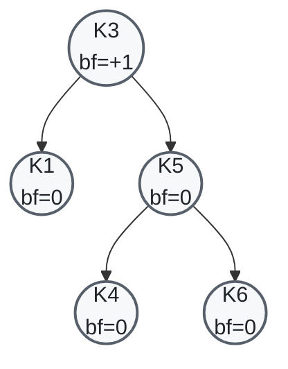

Every node is within AVL bounds. K3's right subtree (rooted at K5, height 1) is one taller than its left (K1, height 0) — `bf=+1`, the limit.

Insert K7. K7 lands as K6's right child (K7 > K6 > K5 > K3). The recursive `upsert` propagates `grew=true` back up the spine, bumping each ancestor's `bf` by +1 (since the insertion went right at every step):

- K6: `bf=0 → +1`, height 0 → 1.
- K5: `bf=0 → +1`, height 1 → 2.
- K3: `bf=+1 → +2` — **unbalanced**.

`Node::rebalance` (`node.rs:267-305`) sees `bf=+2` with K5 at `bf=+1` and dispatches `rotate_left` at K3. K5 takes K3's place; K3 becomes K5's left child; K4 (formerly K5's left) is reparented as K3's new right child; K6 stays as K5's right with K7 below it.

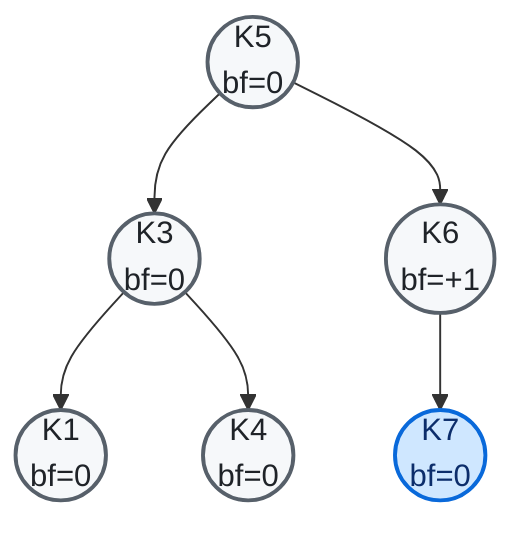

K3 and K5 have swapped roles — K3 was the root, K5 is now the root. K4 has moved from K5's left subtree to K3's right. The proof, however, was constructed against the *initial* layout where K3 was the root and K4 was K5's left child. If the proof system folds the post-rotation working tree to compute the proof's root hash, it produces a hash that no longer corresponds to the initial Normal-mode hash — even though the proof's contents are unchanged.

The two failure modes the previous code hit:

- **Prove side**: folding the working tree produced a proof whose root hash diverged from the initial Normal-mode hash, breaking property (1) in the [Round-trip invariants](#round-trip-invariants) section.
- **Verify side**: when a sub-proof had been deserialised into a `VerifyNodeId::Present`, its `Foldable<PartialHashFold>` implementation used the *parent's* proof view rather than its own captured sub-proof. After a rotation, blinded subtrees that needed `prev_hash` substitution drew that substitution from the wrong proof slot, yielding either a wrong hash or `PartialHash::InvalidProof`.

## The three modes

`MerkleLayer<KV, M>` is parameterised by mode (see [State Components](/state-framework/components)). Each mode keeps a different set of state.

| Mode | Tree representation | Per-step state | Source of root hash |
|---|---|---|---|
| `Normal` | `Tree<LazyNodeId>` | None | `HashFold` over the tree |
| `Prove<'static>` | `initial_tree: LazyTreeId` (snapshot) + `working_tree: Tree<ProveNodeId>` (mutated) | `accessed_items` and `deleted_nodes` on the `ProveResolver` | `HashFold` over `working_tree` |
| `Verify` | `Tree<VerifyNodeId>` decoded from a `MerkleProof` | Each `Present` node carries its captured `MerkleProof` sub-tree | `PartialHashFold` over the tree, using `original_proof` for `prev_hash` substitutions |

The pipeline between modes:

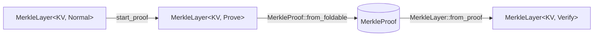

Identifier types per mode:

| | Node identifier | Tree identifier |
|---|---|---|
| Normal | `LazyNodeId` | `LazyTreeId` |
| Prove | `ProveNodeId` (`OnceLock<Rc<Node>>` + inner `LazyNodeId`) | `ProveTreeId` (`OnceLock<Tree>` + inner `LazyTreeId`) |
| Verify | `VerifyNodeId::Present { node, original_proof }` or `Blinded(hash)` | `VerifyTreeId::Present { tree }`, `Blinded(hash)`, or `Absent` |

Two design points worth flagging up front:

- **`ProveNodeId` keeps the original `LazyNodeId`** so its hash stays stable even if the prove-mode projection has not been materialised yet (`resolver.rs:550-557`).
- **`VerifyNodeId::Present` carries an `Option<Arc<MerkleProof>>`** captured at deserialisation time (`resolver.rs:467-474`). This is the verify-side half of the fix; see the [verify side](#how-proof-verification-works-verify-side) section.

Code anchors:

- `merkle_layer.rs:431-439` — `ProveImpl` definition.
- `merkle_layer.rs:414-421` — `VerifyImpl` definition (note the retained `original_proof`).
- `resolver.rs:622-672` — `ProveResolver` and its access-tracking state.
- `resolver.rs:466-494` — `CachedOnlyResolver`, used by the prove-side fold.

## How proof generation works (prove side)

The `MerkleProofFold` implementation on `MerkleLayer<KV, Prove<'_>>` walks the **initial tree**, not the working tree.

For each initial node, the fold checks the resolver's accessed set:

- If the node was not accessed, it is blinded.
- If it was accessed, the fold resolves the initial node (read-only, bypassing access tracking via `ProveResolver::inner()`), then recurses into its initial-tree children. The `meta`/`data` leaves are pulled from the *working tree* (or `deleted_nodes` for nodes that were unlinked during the step), because those carry the per-field read flags that drive `MinimumPresence`.

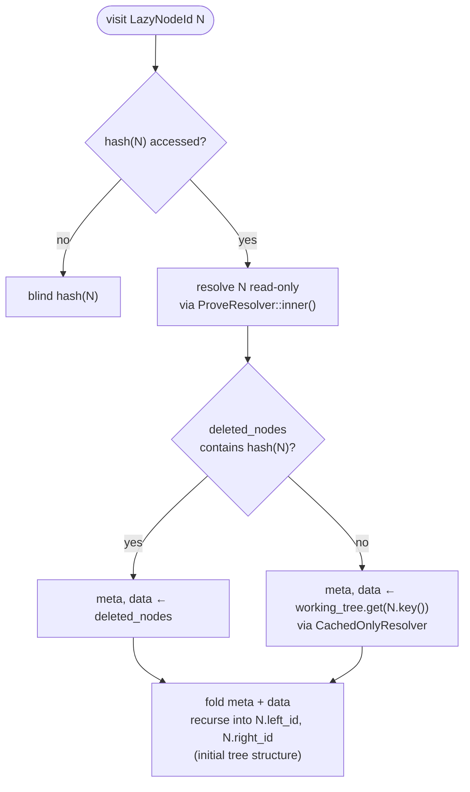

`InitialTreeFold` and `InitialNodeFold` (`merkle_layer.rs:457-575`) are private wrappers that implement `Foldable<MerkleProofFold>` for a `LazyTreeId`/`LazyNodeId` paired with the surrounding `ProveImpl`. They are not standalone `Foldable` impls on the lazy ids themselves, because the lazy ids do not carry the access set on their own.

Why pull `meta`/`data` from the working tree rather than re-resolving the initial node? Because the read flags live on the **prove-mode** projection. The initial `LazyNodeId` resolves to a `Node<LazyTreeId, Normal>` whose `Bytes`/`Atom` components have no read tracking. The prove-mode `Node<ProveTreeId, Prove<'static>>` is constructed lazily on first access, and *that* node's components track which of its fields the step actually read. The fold needs those flags to decide which sub-leaves of the proof can be blinded.

The two-source lookup (`deleted_nodes` first, working tree by key second) handles the case where a node was unlinked during the step:

- If a key was deleted, the working tree no longer has a node at that key. The deleted node's prove-mode fields are captured in `deleted_nodes`, keyed by the **initial** node hash (`resolver.rs:508-525`).
- If a key was deleted and a different value reinserted at the same key, the working-tree lookup would resolve to a *new* node whose flags reflect only the reinsertion. The fold still finds the original deleted node's flags in `deleted_nodes` because that map is keyed by initial hash, and `InitialNodeFold` looks there first.

## How proof verification works (verify side)

Verify mode decodes the proof into a `Tree<VerifyNodeId>`. Each `VerifyNodeId::Present` carries an `Arc<MerkleProof>` — the sub-tree of the original proof from which it was deserialised (`resolver.rs:486-499`).

When the verifier replays the step against this tree, AVL rotations move `Present` nodes around. To compute the resulting root hash, `MerkleLayer::hash` folds the current tree with `PartialHashFold`, threading `original_proof` from the top.

The `Foldable<PartialHashFold>` impl on `VerifyNodeId::Present` overrides the inherited proof with its **captured sub-proof** before delegating to `Node::fold`:

```rust
impl Foldable<PartialHashFold> for VerifyNodeId {
    fn fold(&self, builder: PartialHashFold) -> PartialHash {
        match self {
            VerifyNodeId::Present { node, original_proof } => {
                let builder = builder.with_proof(original_proof.clone());
                node.as_ref().fold(builder)
            }
            VerifyNodeId::Blinded(hash) => builder.present(*hash),
        }
    }
}
```

```mermaid
sequenceDiagram
    participant Top as MerkleLayer::hash
    participant Tree as Tree&lt;VerifyNodeId&gt;
    participant N as Present { node, original_proof }
    participant Inner as Node::fold

    Top->>Tree: fold(builder { proof: original_proof })
    Tree->>N: fold(builder)
    Note over N: builder = builder.with_proof(self.original_proof)
    N->>Inner: node.fold(builder)
    Inner-->>Top: PartialHash
```

Why this is necessary: the parent's proof view describes the parent's *original* children. Once a child has been moved by rotation, blinded grandchildren under it need `prev_hash` substitutions taken from the proof slot they came from — which is the captured sub-proof, not the parent's view.

The proof is stored as `Arc<MerkleProof>` so the override only bumps a refcount (`hash.rs:30-36, 43-50`).

## Worked examples

All four examples start from the same 5-node tree shown in [The problem](#the-problem) (K3 root, K1 left, K5 right with K4 and K6 children, K3 at `bf=+1`). Diagrams use the colour scheme defined at the top of this page: green for accessed, blue for newly inserted, red dashed for deleted/unlinked, grey for untouched.

Code anchors for the test scaffolding are in `merkle_layer.rs:1336-1450` (the `assert_prove_mode_correct` helper).

### Read: `get(K6)`

The simplest case. The resolver tracks the spine `K3 → K5 → K6`. Nothing changes structurally.

The working tree after the step is identical to the initial tree. Read flags on the spine's `meta`/`data` are set; everywhere else they are unread.

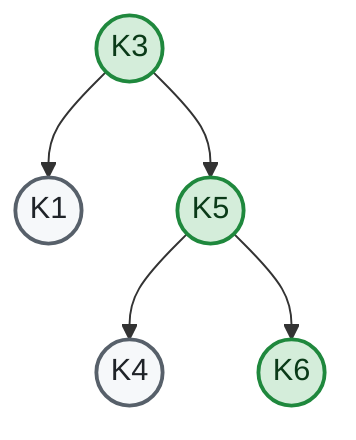

**Resolver state**: `accessed_items.nodes = {h(K3), h(K5), h(K6)}`. `accessed_items.trees` includes the root tree slot and the intermediate tree slots on the spine. `deleted_nodes` is empty.

**Generated proof shape**: spine nodes Present, off-spine subtrees Blinded.

```text
Tree
└── Present(K3)
    ├── meta, data
    ├── left:  Tree → Blinded(h(K1-subtree))
    └── right: Tree → Present(K5)
                   ├── meta, data
                   ├── left:  Tree → Blinded(h(K4-subtree))
                   └── right: Tree → Present(K6)
                                  ├── meta, data
                                  ├── left:  Tree → Blinded(h(empty))
                                  └── right: Tree → Blinded(h(empty))
```

**Verify**: replays `get(K6)` against the decoded tree, hits Present nodes along the spine. `MerkleLayer::hash` recomputes the root and gets the same value as the initial Normal hash because nothing was mutated.

### Write: `write(K6, offset=0, "ZZ")`

Same spine accesses as Read. The structural fields of K6's node are unchanged; only K6's `data` is mutated in place.

The working tree differs from the initial tree only in K6's `data` bytes. No rotation. `deleted_nodes` is empty.

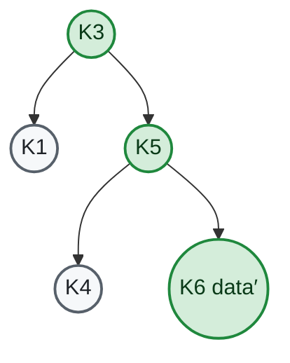

The proof shape is identical to Read. The verifier replays the `write`, mutating K6's `data` in its decoded tree. The captured sub-proof mechanism is harmless here because no rotation happens — but the same machinery that handles 4.4 also handles this case uniformly.

This is the case where the *broken* prior code happened to work, because folding the working tree produces the same shape as folding the initial tree when no rotation occurred.

### Delete: `delete(K6)`

K6 is a leaf. After deletion, K5 has only its left child K4. K5's `bf` goes from 0 to -1 (right shrank: `balance_factor -= 1`). K5's height stays at 1, so K5 did not shrink, K3's `bf` is unchanged. No rebalance.

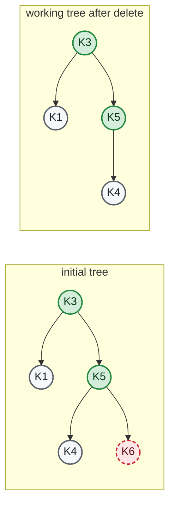

**Resolver state** after the step:

- `accessed_items.nodes = {h(K3), h(K5), h(K6)}`.
- `deleted_nodes = { h(K6) → DeletedNodeFields { meta, data } }`.

When `InitialNodeFold` visits K6 during the proof fold:

- `working_tree.get(K6.key)` would return `None` (K6 was unlinked), so the working-tree fallback path would fail.
- The first lookup, `deleted_nodes[h(K6)]`, succeeds and yields the captured prove-mode fields.

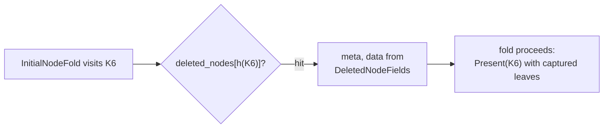

**Verify**: replays `delete(K6)` over the decoded tree. The decoded tree has K6 as Present (its slot was not blinded), so the AVL machinery can locate and unlink it. Hashing the post-delete tree uses the captured sub-proofs on the spine to resolve `prev_hash` substitutions for blinded siblings.

### Insert with rebalance: `set(K7, "Z")`

This is the case that motivated the fix. K7 lands as K6's right child; the recursive `upsert` propagates `grew=true` back up the spine, bumping each ancestor's `bf` by +1 because the insertion went right at every step:

| Node | `bf` before | `bf` after | Notes |
|---|---|---|---|
| K6 | 0 | +1 | gained right child K7; height 0 → 1 |
| K5 | 0 | +1 | right subtree (K6) grew; height 1 → 2 |
| K3 | +1 | **+2** | right subtree (K5) grew; **unbalanced** |

`Node::rebalance` (`node.rs:267-305`) sees `bf=+2` at K3 with K5 at `bf=+1`, dispatches `rotate_left`. K5 takes K3's place as the new root, K3 becomes K5's left child, K4 (formerly K5's left) is reparented as K3's right child, K6 stays as K5's right with K7 below it.

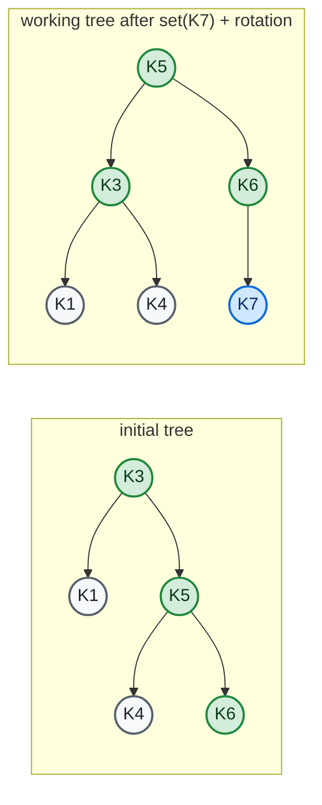

K3 was the root of the initial tree; K5 is the root of the working tree. K4 has changed parents — it sits under K3 in the working tree but was K5's left child in the initial tree.

**Resolver state**: `accessed_items.nodes = {h(K3), h(K5), h(K6)}` — the path the insert took, plus the rotation pivots. K1 and K4 are not directly resolved during the rotation. `deleted_nodes` is empty: K3, K5, and K6 are still in the working tree, just at different positions.

**Why the prove-side fold must walk the initial tree**, not the working tree:

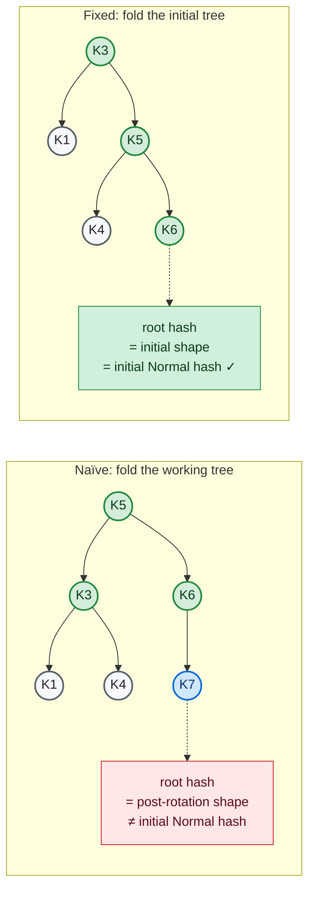

When `InitialNodeFold` visits initial K3 (the initial root) it pulls K3's read flags via `working_tree.get(K3.key)` using `CachedOnlyResolver`. K3 is no longer the root of the working tree — it sits below K5 — but the lookup finds it by key, not by position. The same mechanism handles K5 and K6 at their new positions.

`CachedOnlyResolver` is a read-only resolver that only returns nodes already cached on `ProveNodeId`/`ProveTreeId` (`resolver.rs:466-494`). This is safe because any node the fold reaches from an accessed initial node is either resolved (because it was accessed) or below an accessed sibling — in both cases its prove-mode projection has already been built.

**Verify-side rotation**: when the verifier replays `set(K7, "Z")`, the same rotation happens in the decoded tree. K3, K5, and K6 (all `VerifyNodeId::Present`) move; K7 is created fresh with `original_proof = None`. Each Present node folded under `MerkleLayer::hash` overrides the inherited proof with its own captured sub-proof:

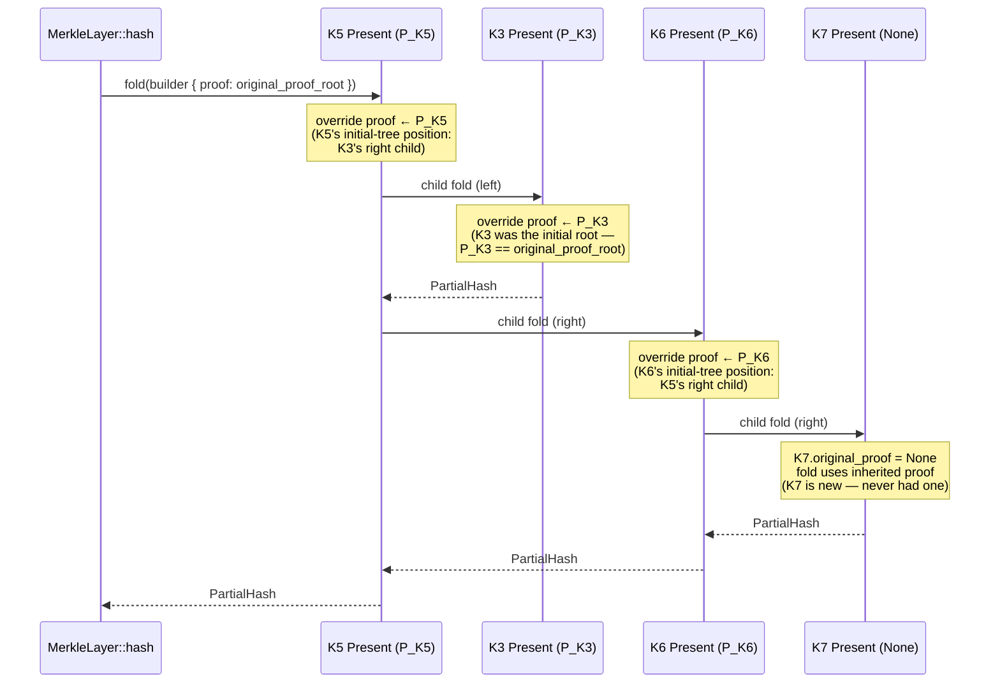

Without the captured-proof override, when K3 (now demoted to a left child) folds its blinded K1-subtree, the parent (K5) would have popped a child slot from K5's proof view — but K5's initial proof view describes K5's *initial* children (K4 and K6), not K3's children. The substitution would land on the wrong slot. The captured-proof override redirects K3's fold back to K3's own initial-tree position (where K3 was the root), so the K1 slot resolves against the proof view that actually describes K1.

## Decoding blinded empty subtrees

The proof format represents subtrees the prover did not access as `Blinded(hash)` — the verifier holds the hash but not the contents. That is fine for any subtree the verifier never needs to read, but it breaks if the verifier needs to *traverse* the subtree.

An AVL operation walks the tree to find an insertion or deletion point. When it reaches an empty slot — the bottom of the spine where a new key will be attached, or a leaf's missing child during a rotation — it has to know the slot is empty so it can:

- create a new node there (for `set` on a new key),
- recognise it as the base case for recursion (for `delete`), or
- compute the post-rotation balance factor that depends on a child being absent.

If that slot were left as `VerifyTreeId::Blinded(hash)`, every one of those checks would fail. `VerifyResolver::resolve` on a `Blinded` variant returns `not_found()` (`resolver.rs:893-913`), and the AVL machinery would terminate the step before it could complete.

`Tree::from_proof` (`tree.rs:74-78`) handles this by short-circuiting any `Blinded(hash)` slot whose hash equals the empty-tree hash, decoding it as `Tree::default()` instead of `VerifyTreeId::Blinded`:

```rust
Partial::Blinded(hash) if hash == *EMPTY_TREE_HASH => {
    Ok((ctx, Partial::Present(Tree::default())))
}
```

The constant is computed once at startup as `Hash::from_foldable(&Tree::<LazyNodeId>::default())` (`tree.rs:705-708`). It is independent of any key, prover input, or step.

### Why this is safe

The empty-tree hash is a fixed constant derived from the serialisation of the empty tree alone. A blinded slot can only carry that hash if the subtree at that position was actually empty in the initial tree — collision resistance prevents any other shape from hashing to it. Substituting `Tree::default()` for `Blinded(EMPTY_TREE_HASH)` therefore does not extend the verifier's trust: an honest prover could have emitted an explicit `Present(Tree::default())` and produced an equivalent proof.

A malicious prover cannot exploit the short-circuit either. The hash check is exact equality against a deterministic constant, so the worst a prover can do is *correctly* claim the subtree is empty.

### Where this matters in the worked examples

The Read proof shape in [Read: `get(K6)`](#read-get-k6) shows three `Blinded(h(empty))` slots — under K6's two child positions, and under K1 (whose only-child slots are also empty). On the verify side, all of them deserialise to `Tree::default()`. Without that, replaying any operation that descends past K6 into either of its children, or past K1 into its missing children, would terminate with `not_found()` before reaching the AVL leaf logic.

The [Insert with rebalance](#insert-with-rebalance-set-k7-z) example needs this even more directly: K7 is being attached to K6's right slot, which is `Blinded(h(empty))` in the proof. The verifier must materialise that slot as `Tree::default()` so the AVL upsert can attach K7 there.

### Stop-gap framing

This is tracked under `RV-895`. A cleaner design would have the proof emit an explicit `Present(Tree::default())` for empty subtrees rather than blinding them at all, removing the special case in `Tree::from_proof` and making the proof structurally self-describing. The current behaviour is correct but couples the deserialiser to a specific known constant — a small but real cross-cutting concern.

## Round-trip invariants

`assert_prove_mode_correct` (`merkle_layer.rs:1340-1450`) checks three properties for every proptest case:

1. **`proof.root_hash() == initial_normal_hash`.** The proof faithfully encodes the initial state. Broken when the prove-side fold walked the working tree instead of the initial tree.
2. **`prove_final_hash == normal_final_hash`.** Prove-mode mutations are faithful to Normal-mode semantics. This was always correct: prove-mode operations are Normal-mode operations with read tracking layered on top.
3. **`verify_final_hash == prove_final_hash`.** The proof carries enough information for full verification. Broken when verify-side `Present` nodes folded against the parent's proof rather than their own captured sub-proof.

Property (1) corresponds to the prove-side fix in [Proof generation](#how-proof-generation-works-prove-side). Property (3) corresponds to the verify-side fix in [Proof verification](#how-proof-verification-works-verify-side).

## Limitations and open work

- **Single-step only.** Multi-step proofs (`RV-985`) require carrying access state and per-step proofs across transitions. The current `assert_prove_mode_correct` proptests are deliberately limited to `ops_count = 1`.
- **`into_blind` API is a stop-gap** for `RV-968`: the prove-side fold currently constructs `CompressibleMerkleProof` blinds via `into_blind`. A non-compressible blind constructor would make the intent clearer.
- **Newly-created prove-mode nodes** use a sentinel hash (`Hash::hash_bytes(&[])`) in their inner `LazyNodeId` (`resolver.rs:530-538`). This is tracked under `RV-895`. It is not load-bearing for the proof-fold path, since `InitialNodeFold` never visits new nodes — they have no entry in the initial tree.
- **Empty-tree blinding short-circuit.** See [Decoding blinded empty subtrees](#decoding-blinded-empty-subtrees) — also tracked under `RV-895`.

## Code map

| Component | Location |
|---|---|
| `MerkleLayer<KV, M>` and per-mode trait dispatch | `durable-storage/src/merkle_layer.rs:64-319` |
| `ProveImpl`, `InitialTreeFold`, `InitialNodeFold` | `durable-storage/src/merkle_layer.rs:431-575` |
| `VerifyImpl`, `from_proof`, `Verify::hash` | `durable-storage/src/merkle_layer.rs:268-289, 414-421` |
| `ProveResolver`, `accessed_items`, `deleted_nodes` | `durable-storage/src/avl/resolver.rs:622-703` |
| `ProveNodeId::Drop` (captures fields into `deleted_nodes`) | `durable-storage/src/avl/resolver.rs:508-525` |
| `CachedOnlyResolver` | `durable-storage/src/avl/resolver.rs:466-494` |
| `VerifyNodeId`, captured-proof override | `durable-storage/src/avl/resolver.rs:467-520` |
| `PartialHashFold::with_proof`, `Arc<MerkleProof>` plumbing | `data/src/hash.rs:30-50` |
| `Deserialiser::capture_owned_proof` | `data/src/merkle_proof.rs:154-175`, `data/src/merkle_proof/proof_tree.rs:515-525` |
| Round-trip property tests | `durable-storage/src/merkle_layer.rs:1336-1836` |
