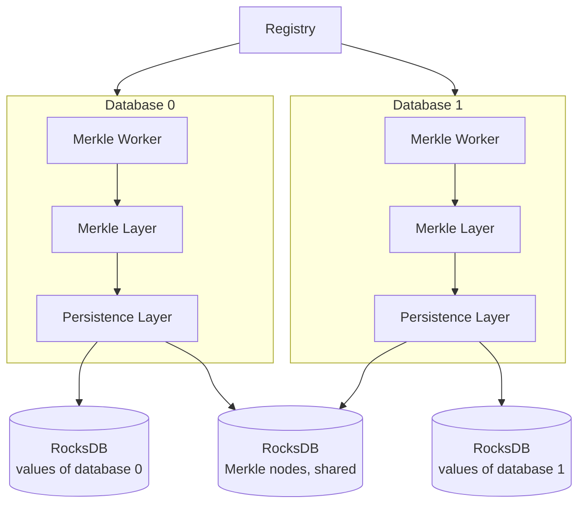

A registry owns a set of databases.
Each database pairs a [Persistence Layer](/new-durable-storage/persistence-layer), which stores its values, with a Merkle Worker, which maintains the Merkle tree that authenticates them.

- [Registry and databases](/new-durable-storage/registry-and-databases): the interface you use. A registry holds an ordered collection of databases and commits them together. Each database is an independent key-value store.
- [Merkle Layer](/new-durable-storage/merkle-layer): the AVL tree over a database's keys and values, which gives every state a root hash and supports producing and verifying proofs of operations against it.
- [Merkle Worker](/new-durable-storage/merkle-worker): keeps each database's Merkle tree up to date in a background task, so writes do not wait for it.
- [Persistence Layer](/new-durable-storage/persistence-layer): stores each database's values in RocksDB, and the Merkle Layer's nodes in a store shared by the whole repository. Committing a database takes a checkpoint of its values.
