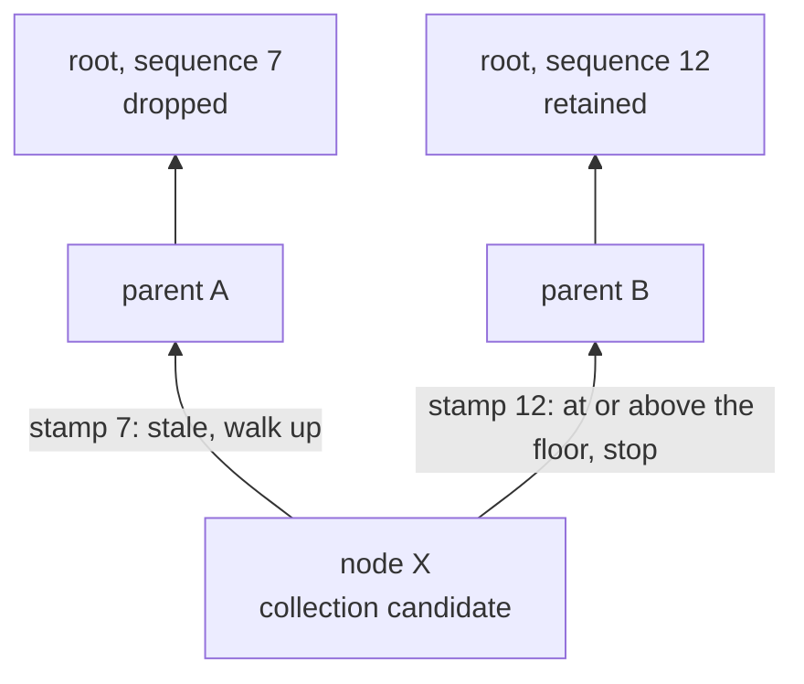

The durable storage keeps every state it has ever committed.
Nothing removes a commit, so disk use only ever grows.

A rollup node cannot run that way.
`octez-smart-rollup-node` expects its context to drop states older than a chosen one, so that a node keeps only the history it still needs.

This page describes how commits occupy disk today, which parts of them the storage already reclaims, and which parts it cannot reclaim at all.
The two halves of a commit behave completely differently, and the difference is what the garbage collection design follows from.

## How commits occupy disk

A repository is a directory tree of databases and commits:

```text
<repo_path>/
  databases/
    temporary/db_<random>/checkpoint/   working databases
    commits/<commit_id>/                database commits
  registries/commits/<commit_id>        registry manifests
```

Each database is a RocksDB instance holding two column families:

| Column family | Contents | Keyed by |
|---|---|---|
| `default` | Values you store | Your key |
| `blob` | Merkle (AVL) node bodies | Hash of the tree that holds the node |

A database commit is a RocksDB checkpoint, taken with `Checkpoint::create_checkpoint`.
A checkpoint flushes both column families' memtables and then **hard-links** the SST files, so a commit shares its data with the working database instead of copying it.
That makes committing cheap, and it leaves a directory another process can open read-only without disturbing it: a checkpoint is a complete database in its own right - its own `CURRENT` and `MANIFEST`, alongside hard links to the SST files - and a read-only open writes nothing whatsoever into what it reads, not even a log.

A registry commit is a single file naming the database commits that make up that registry.
Database commits are content-addressed, so several registry commits can name the same database commit.

## What the storage reclaims today

### Values are reclaimed

Values are keyed by your key, so a new write to a key makes the previous value an obsolete version of a live key, and compaction discards it.
Deleting a key writes a tombstone, which compaction also discards.
The storage holds no RocksDB snapshots, so nothing delays either.
A working database therefore stays proportional in size to the key space that is actually live in it.

Commit directories hold the same data through hard links, so the blocks behind an SST are freed once no directory references it any more.
Deleting the commit directories that are no longer reachable from any retained registry manifest is therefore enough to reclaim the value data those commits were pinning.

### Merkle nodes are not

Node bodies are content-addressed.
Every version of every node is a distinct key, and nothing ever deletes one — `blob_delete` has no callers outside tests.
RocksDB has no way to know that an old node is dead, so compaction preserves all of them.

The consequence is that the newest commit of a database hard-links SSTs that hold **every node ever written to it**.
Deleting older commit directories frees nothing there, because the newest commit and the working database still reference the same files.

<Warning>
The `blob` column family grows with the total number of node writes over the lifetime of a database, not with the size of the state.
No amount of commit deletion reclaims it, because the dead nodes sit in files that live commits still need.
Reclaiming them requires deleting the node keys themselves and letting compaction rewrite the files.
</Warning>

### There is no entry point

Nothing in the crate exposes a garbage collection operation.
The only reachability logic that exists is `long_test/registry/gc.rs`, which the long-running test uses to bound its own disk use: it computes the database commits reachable from the registry manifests it retains, and removes the rest.

## Why retaining a commit costs more than its changes

Checkpoints hard-link the files that were live when they were taken, so retaining a commit should cost only what that commit changed: the next checkpoint links the same files for everything untouched.
It costs more than that, and the reason is not the design but how commits reach the store.

Sharing is not all-or-nothing.
On an ordinary commit, consecutive checkpoints share around 98% of their bytes, which is what the layout intends.
What breaks it now is compaction, and only compaction — a second cause, commits rewriting nodes that had not changed, has been fixed.

### Commits store only the nodes they changed

A node records which store it is already in.
Committing skips such a node and, with it, the whole subtree beneath: nodes are content-addressed, so changing a descendant changes every hash above it, and an unchanged node cannot have a changed descendant.

The record is dropped by the same thing that invalidates a node's cached hash, so it survives exactly the mutations that leave the stored copy still correct.
It names the store rather than being a plain flag, because a tree can be shared between stores: copying a database hands the destination a copy of the source's store and the same in-memory nodes, so a node not yet written owes a copy to each of them.
A flag would let the first commit satisfy that obligation and the second skip it, leaving a commit that refers to nodes which never reached its store.

One cost remains from this: a node written before its tree was shared is not recognised as being in the store that was copied, even though the copy holds it, so it is written again once.
Distinguishing writes made before the two stores diverged from writes made after would need more than a single identity.

Committing the same state twice now does nothing at either end: the nodes are already recorded as being in this store, and a commit id is the hash of the state, so the publish step finds it already published and takes no checkpoint.

Without this, committing rewrote every node resolved in memory, changed or not — the whole tree for a state just built, and a growing share of it for a state checked out, since the resolved set only ever grows.

### Compaction rewrites whole levels

A checkpoint is created with `Checkpoint::create_checkpoint`, which flushes the memtables of both column families first — `rust-rocksdb` passes a `log_size_for_flush` of zero, which RocksDB defines as *always flush*.
So every commit produces one new level-zero file per column family, whatever it holds.

Level-zero compaction triggers on the *number* of files, so it runs however little each commit wrote.
Keys are spread by hash, so a level-zero file spans the whole key space and overlaps everything below it.
Each compaction therefore rewrites the entire base level into new files, and every checkpoint taken before it stops sharing them.

<Warning>
Writing less per commit does not reduce this.
The trigger counts files, and a forced flush produces one per commit regardless of what it holds, so compaction runs on a cadence set by how often you commit rather than by how much you write.
</Warning>

The trigger is therefore set to twenty rather than RocksDB's default of four, which makes that cadence five times coarser and cuts the cost of retaining a commit by most of what compaction was adding to it.

Both column families also carry whole-key bloom filters.
A lookup is by whole key in both — blobs by content hash, values by their key — so a filter lets a lookup skip a file outright, where otherwise it consults the index of every file whose range covers the key, which for hash-spread keys is most of them.
Filters matter more as level zero holds more files, but the coarser trigger does not in fact cost reads: compacting often does not keep level zero small, because each compaction rewrites the whole base level, and flushes accumulate behind it while it runs.

What remains of the gap is the flush.
A commit still forces a level-zero file per column family whatever it holds, so cadence still drives compaction — five times less often, but by the same mechanism.

## Planned mechanism

<Note>
This section describes work that is not implemented yet.
Everything above describes how the storage behaves today.
Sections move out of here as the work lands.
</Note>

The two halves of a commit are reclaimed by two different mechanisms, for the reasons above.

### Retained roots

A *root* here is a registry commit id: the hash of an entire registry state, and so the root of the Merkle tree over it.
A repository records the order in which commits were made, as a sequence number per root.
Collecting at a root `H` retains every root whose sequence number is at least that of `H`, and drops the rest.

```text
                                   floor: the sequence number of H
                                   |
  sequence     1      4      7     |    10      12      15
  root        r1     r2     r3     |     H      r5      r6
              +------ dropped -----+     +------ retained ------+
```

Retaining by insertion order rather than by ancestry keeps states whose provenance is unclear, such as a state committed without a parent.
Where a root has been committed more than once, the storage keeps the highest sequence number for it.

Parents and sequence numbers are recorded beside a root, not folded into its identity.
A commit id therefore stays the registry root hash, so committing the same state twice stays the no-op it already is.

### Key-value side: directory reachability

Values keep their current layout of one checkpoint directory per database commit.
Collection computes the database commits reachable from the retained registry manifests, then removes the unreachable commit directories and manifests.
The work is crash-safe and resumable, because removing an already-removed directory is not an error.

This also keeps commit directories openable read-only by other processes, which is how external tooling reads a running node's storage.

### Merkle side: one shared store

Node bodies move out of the per-database instances into a single store shared by the whole repository.
Sharing gives deduplication between commits and between the databases of a registry, and it gives one place from which nodes can actually be deleted.

It also takes node bodies out of the retention problem described above.
Node data is the large majority of what retained commits pin, so a store outside the per-commit checkpoints pays its own compaction churn once rather than once per retained commit.

A commit directory then holds only the values, so it is self-contained in the sense above but no longer holds the nodes those values are indexed by.
Reading a commit's tree from another process therefore means reading the shared store as well, which is what the slots below are for.

Liveness is tracked with explicit reverse edges rather than reference counts, in a column family keyed by `child_hash || parent_hash`.
Explicit edges are idempotent: writing an edge twice, or removing it twice, leaves the same state, so an interrupted collection can simply be repeated.
Reference counts cannot offer that, because a count that is incremented twice after a crash is silently wrong.

Each edge carries the sequence number of the most recent root known to contain the child.
Collection reads that first: a stamp at or above the collection floor means the child is still held by a retained root, so the sweep stops there instead of walking up to a root.
A stamp below the floor is stale, so the sweep walks up, then rewrites the stamp with what it learned.

With a floor of 10, node `X` is settled without walking to a root at all: the edge to `B` is stamped at or above it, so `X` is still held.



A stamp is only ever written where the node is provably reachable from the stamped root.
At commit time that holds by construction.
During a sweep it holds because nodes are content-addressed and therefore immutable: if a parent is reachable from a root, and that parent references a child, then the child is reachable from that root too, permanently.
A stale stamp only costs a walk, and an over-generous stamp only retains garbage, so neither can delete something that is still live.

<Warning>
The stamp rule depends on a root being dropped only when its sequence number falls below the floor.
A future mode that drops individual newer roots, such as collecting abandoned branches, would break the inference that a stamp at or above the floor implies a surviving root, and would need per-root liveness instead.
</Warning>

### Durability and recovery

Committing separates into two operations.

A **partial commit** writes the value checkpoint, the registry manifest and the root record.
A **full commit** additionally checkpoints the shared Merkle store into a numbered slot.
The rollup node chooses when to take a full commit, and distinguishes the two.

Slots are named by an increasing counter, so a new slot is created by renaming a completed directory to a name that does not exist yet, which is atomic.
Recovery opens the highest slot present.
Because a slot is created by a checkpoint, it is self-contained and needs no write-ahead log.

Slots are also what other processes read, since the live store cannot be opened by a second writer.
A reader takes a lease on the slot it opens, and slot reaping respects leases.
Leases use `flock`, so the kernel releases a lease held by a process that dies.

Space is reclaimed at full-commit granularity: the previous slot hard-links the files that compaction has since rewritten, so those files are freed when that slot is reaped.

The split also gives the Merkle store's flush a natural home.
A partial commit still checkpoints the value database, so that database's memtable is still flushed and still produces a level-zero file per commit; compacting values is work worth doing anyway, since that is what discards the obsolete versions overwriting leaves behind.
What the split removes is the Merkle store's flush from every commit: the store is checkpointed only at a full commit, so how often its files are rewritten stops being set by how often you commit and starts being set by how much has been written to it.

### Interface

The storage exposes collection as an operation that starts in the background, together with the operations a rollup node needs to observe and control it: whether a collection has finished, cancelling one, and waiting for one to complete.

Exporting a snapshot copies everything reachable from one root into a fresh store, which is the same traversal collection performs, so the two share an implementation.
