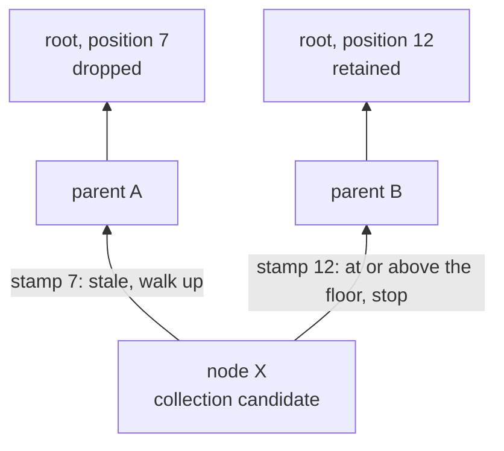

The durable storage drops states older than a chosen one, reclaiming both halves of the commits it drops.
That is what `octez-smart-rollup-node` expects of its context: keep only the history it still needs.

This page describes how commits occupy disk and how each half of one is reclaimed.
The two halves behave completely differently, and that difference is why they need two mechanisms rather than one.

## How commits occupy disk

A repository is a directory tree of databases and commits:

```text
<repo_path>/
  databases/
    temporary/db_<random>/checkpoint/   working databases
    commits/<commit_id>/                database commits
  registries/commits/<commit_id>        registry manifests
  registries/journal                    the order commits were made in
  merkle/                               Merkle node bodies, shared by the repository
  merkle-commits/<n>/                   recoverable images of that store
```

Each database is a RocksDB instance holding the values you store, keyed by your key.
Merkle (AVL) node and tree bodies are keyed by content hash and live in one store shared by the whole repository, not in the databases.

A database commit is a RocksDB checkpoint of that database, taken with `Checkpoint::create_checkpoint`.
A checkpoint flushes the memtable and then **hard-links** the SST files, so a commit shares its data with the working database instead of copying it.
That makes committing cheap, and it leaves a directory another process can open read-only without disturbing it: a checkpoint is a complete database in its own right - its own `CURRENT` and `MANIFEST`, alongside hard links to the SST files - and a read-only open writes nothing whatsoever into what it reads, not even a log.

A commit directory therefore holds that database's values, and the nodes indexing them are found through the repository.
Committing syncs the Merkle store before taking the checkpoint, so a commit never refers to a node that a crash could take with it.

A registry commit is a single file naming the database commits that make up that registry.
Database commits are content-addressed, so several registry commits can name the same database commit.

### Why nodes are shared

A node reachable from several databases used to be stored once per database, and every commit directory hard-linked the files holding every node its database had ever written.
Node data is the large majority of what a retained commit pins, so that cost was paid again for each commit kept.

Sharing removes it at a stroke: nodes are content-addressed, so the same node written from anywhere is the same key and is stored once.
The store sits outside the per-commit checkpoints, so its compaction churn is paid once instead of once per retained commit, and it gives one place from which a node can actually be deleted.

What a retained commit pins is now values alone.

<Note>
RocksDB allows one writer per directory, so a repository has one instance of this store however many handles are open onto it.
Constructing a `DirectoryManager` opens it and holds it, and handles for the same path share it.
</Note>

### Reading a repository someone else is writing

A single writer per directory also means a second process cannot open a repository the ordinary way at all, and reading a running node's storage from outside is something external tooling has to do.

`DirectoryManager::open_read_only` opens the store for reading instead, which any number of processes may do at once.
Reading a commit through it works as it does anywhere; writing through it is refused rather than failing somewhere further down.

<Warning>
The view is of the store as it stood when it was opened, and it is not protected from collection: nodes it can reach may be deleted while it holds them.
Reading one then fails rather than returning something wrong.
</Warning>

## What the storage reclaims today


### Collecting at a root

A *root* here is a registry commit id: the hash of an entire registry state, and so the root of the Merkle tree over it.

Collecting at a root drops the registry commits recorded before it, together with the database commits that none of the surviving registry commits still reference.

A repository records the order in which commits were made, as a sequence number per root, in a journal beside the manifests.
Collection retains by that order: every root recorded at or after the target survives, and the rest are dropped.
Retaining by insertion order rather than by ancestry keeps states whose provenance is unclear, such as one committed without a parent.
Where a root has been committed more than once, the storage keeps its highest position, so re-committing a state can only extend how long it is retained — which is also how you pin a root you want kept.

```text
                                   floor: the target's position
                                   |
  position     1      4      7     |    10      12      15
  root        r1     r2     r3     |     T      r5      r6
              +------ dropped -----+     +------ retained ------+
```

A commit id stays the registry root hash, so committing the same state twice remains idempotent.
Sequence numbers are recorded beside a root, not folded into its identity.

Database commits are content-addressed and therefore shared: unrelated registry commits name the same database commit whenever their states agree.
Removal follows reachability rather than recorded order, so a database commit survives for as long as any retained registry commit still names it.

Collection is safe to interrupt and repeat.
It prunes the journal to the retained roots, removes the manifests of the registry commits it dropped, then removes the database commits no retained manifest reaches.
Everything retained is intact at each point in between, and each step after the first enumerates what is present rather than what the journal says should be, so a round left unfinished is picked up by the next one.
Pruning first is also what makes a stale target safe: a root an earlier round already collected past is no longer in the journal, so collecting at it is refused rather than taken as a floor that would retain commits whose data has already gone.

<Warning>
Collection must not run while the repository is being committed to, and two collections must not overlap.
Neither is enforced.
</Warning>

The two sections below are what that removal means for each half of a commit.

### Values are reclaimed

Values are keyed by your key, so a new write to a key makes the previous value an obsolete version of a live key, and compaction discards it.
Deleting a key writes a tombstone, which compaction also discards.
The storage holds no RocksDB snapshots, so nothing delays either.
A working database therefore stays proportional in size to the key space that is actually live in it.

Commit directories hold the same data through hard links, so the blocks behind an SST are freed once no directory references it any more.
Deleting the commit directories that are no longer reachable from any retained registry manifest is therefore enough to reclaim the value data those commits were pinning.

### Merkle nodes need deleting outright

Node bodies are content-addressed, so every version of every node is a distinct *live* key.
RocksDB has no way to know that an old node is dead, and compaction preserves all of them.

Removing commit directories cannot reach them at all, plainly so now: the Merkle store is not a commit directory and no commit directory holds a link to it.
Left alone the store would grow with the total number of node writes over a repository's lifetime rather than with the size of the state.

So this half is reclaimed by deleting the node keys themselves, which needs a way to know which nodes are still held.
That is what the next two sections are.

### What refers to what is recorded

As a node is stored, an edge is recorded from each of its children to it, in a `refs` column family of the Merkle store keyed by `child_hash || parent_hash`.
Empty trees are never stored, so no edge points at one.

Explicit reverse edges rather than reference counts, because they are idempotent: writing an edge twice, or removing it twice, leaves the same state, so a collection interrupted part-way can simply be run again.
A count that is incremented twice after a crash is silently wrong for good.

Recording them from the child's side is what will let a node's liveness be decided from the node upwards, rather than by traversing every retained root downwards.
Each edge has room for a stamp saying how recently its child was known to be held; edges are written without one, since the sequence number of the commit being made is not settled while its nodes are being written.

They cost a 64-byte key and an 8-byte stamp apiece, at a little under two edges per node.

### Merkle nodes are collected too

Collecting at a root deletes the node bodies that no retained root still reaches, and the edges that mentioned them.

Whether a node is still held is asked from the node upwards, by walking its reverse edges, rather than by traversing every retained root downwards.
A stamp at or above the collection floor ends the walk immediately: a retained root already holds the child.
Otherwise the walk climbs, and what it learns is written back onto the edges that led to a live root, so the next collection reads the answer instead of walking for it.

With a floor of 10, node `X` is settled without walking to a root at all: the edge to `B` is stamped at or above it, so `X` is still held.



A stamp is only ever written where the node is provably reachable from the stamped root.
Nodes are content-addressed and therefore immutable, so if a parent is reachable from a root and that parent refers to a child, the child is reachable from that root too, permanently.
A stale stamp costs a walk and an over-generous one retains garbage; neither can drop something still live.

The graph has no cycles to guard against: a node's hash is derived from its children's, so a node can never be its own ancestor.

<Warning>
Deleting a node writes a tombstone; the bytes come back when compaction rewrites the files without it.
Collection asks for that compaction, so what it reports as freed is freed.
</Warning>

## Why retaining a commit costs more than its changes

Checkpoints hard-link the files that were live when they were taken, so retaining a commit should cost only what that commit changed: the next checkpoint links the same files for everything untouched.
It costs more than that, and the reason is not the design but how commits reach the store.

Sharing is not all-or-nothing.
On an ordinary commit, consecutive checkpoints share around 98% of their bytes, which is what the layout intends.
What breaks it now is compaction, and only compaction — a second cause, commits rewriting nodes that had not changed, has been fixed.

### Commits store only the nodes they changed

A node records which store it is already in.
Committing skips such a node and, with it, the whole subtree beneath: nodes are content-addressed, so changing a descendant changes every hash above it, and an unchanged node cannot have a changed descendant.

The record is dropped by the same thing that invalidates a node's cached hash, so it survives exactly the mutations that leave the stored copy still correct.
It names the store rather than being a plain flag, because a tree can be shared between stores: copying a database hands the destination a copy of the source's store and the same in-memory nodes, so a node not yet written owes a copy to each of them.
A flag would let the first commit satisfy that obligation and the second skip it, leaving a commit that refers to nodes which never reached its store.

One cost remains from this: a node written before its tree was shared is not recognised as being in the store that was copied, even though the copy holds it, so it is written again once.
Distinguishing writes made before the two stores diverged from writes made after would need more than a single identity.

Committing the same state twice now does nothing at either end: the nodes are already recorded as being in this store, and a commit id is the hash of the state, so the publish step finds it already published and takes no checkpoint.

Without this, committing rewrote every node resolved in memory, changed or not — the whole tree for a state just built, and a growing share of it for a state checked out, since the resolved set only ever grows.

### Compaction rewrites whole levels

A checkpoint is created with `Checkpoint::create_checkpoint`, which flushes the memtables of both column families first — `rust-rocksdb` passes a `log_size_for_flush` of zero, which RocksDB defines as *always flush*.
So every commit produces one new level-zero file per column family, whatever it holds.

Level-zero compaction triggers on the *number* of files, so it runs however little each commit wrote.
Keys are spread by hash, so a level-zero file spans the whole key space and overlaps everything below it.
Each compaction therefore rewrites the entire base level into new files, and every checkpoint taken before it stops sharing them.

<Warning>
Writing less per commit does not reduce this.
The trigger counts files, and a forced flush produces one per commit regardless of what it holds, so compaction runs on a cadence set by how often you commit rather than by how much you write.
</Warning>

The trigger is therefore set to twenty rather than RocksDB's default of four, which makes that cadence five times coarser and cuts the cost of retaining a commit by most of what compaction was adding to it.

Everything here also carries whole-key bloom filters.
Lookups are by whole key throughout — nodes by content hash, values by their key — so a filter lets a lookup skip a file outright, where otherwise it consults the index of every file whose range covers the key, which for hash-spread keys is most of them.
Filters matter more as level zero holds more files, but the coarser trigger does not in fact cost reads: compacting often does not keep level zero small, because each compaction rewrites the whole base level, and flushes accumulate behind it while it runs.

What remains of the gap is the flush.
A commit still forces a level-zero file for the database it commits, whatever that holds, so cadence still drives compaction — five times less often, but by the same mechanism.
The Merkle store is not checkpointed per commit, so nothing forces a flush there and its compaction follows how much is written rather than how often.

## Durability and recovery

### Full commits

Committing puts a database's values in a commit directory and syncs the nodes they refer to, so a commit never outlives its nodes.
It leaves the Merkle store as the only copy of them.

A **full commit** takes another: a checkpoint of the store into a numbered slot under `merkle-commits/`.
Recovery opens the most recent slot.
Because a slot is made by a checkpoint it is self-contained and needs no write-ahead log, and because a checkpoint hard-links rather than copies, taking one costs almost nothing.
The live store carries on unchanged; whether to check anything out again afterwards is the caller's decision.

Slots are numbered so that each name is fresh, and a slot is created by renaming a finished directory to a name that does not exist yet, which is atomic and cannot half-happen.
A fixed name plus a `CURRENT` pointer would need the pointer swapped separately, and renaming over an existing directory is not available anyway: `rename(2)` fails with `ENOTEMPTY` on a non-empty target.
A directory left behind by an interrupted full commit is not a slot, and the next attempt replaces it.

<Warning>
A slot's hard links hold the files that were live when it was taken, so compaction rewriting those files does not free them until the slot is reaped.
The high-water mark is the live set plus roughly one full-commit period of garbage, which makes the full-commit cadence the reclamation cadence.
Reaping never removes the last slot, so a repository always has something to recover from.
</Warning>

## Planned mechanism

<Note>
This section describes work that is not implemented yet.
Everything above describes how the storage behaves today.
Sections move out of here as the work lands.
</Note>

### Leases for other processes

Slots are what other processes read, since the live store cannot be opened by a second writer.
A reader takes a lease on the slot it opens, and reaping respects leases.
Leases use `flock`, so the kernel releases one held by a process that dies.

### Where the flush belongs

A partial commit does not need the Merkle store's memtable on disk, so it does not need the flush that forces a level-zero file there; a full commit does.
The value database is still checkpointed by a partial commit and so still flushed, and its own level-zero file per commit remains - compacting values is what discards the obsolete versions that overwriting leaves behind, so that work is worth doing.
Putting the durability boundary and the flush boundary in the same place is what stops the store's compaction from being driven by commit cadence.

### Interface

Collection runs to completion in the caller's thread today.
The storage instead exposes it as an operation that starts in the background, together with the operations a rollup node needs to observe and control it: whether a collection has finished, cancelling one, and waiting for one to complete.
Serialising it against committing, which the caller is currently responsible for, belongs with those.

Exporting a snapshot copies everything reachable from one root into a fresh store, which is the same traversal collection performs, so the two share an implementation.
