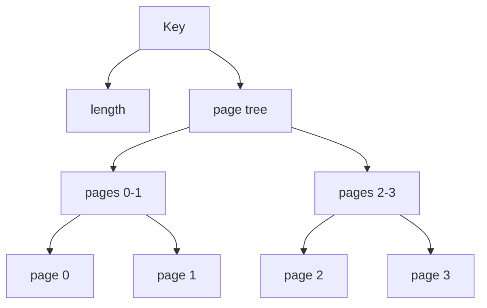

Every operation on a database walks the [Merkle Layer](/new-durable-storage/merkle-layer)'s AVL tree from the root, comparing the key it is looking for against the key of each node on the way down.
A proof of that operation has to let the verifier redo every one of those comparisons, so each node on the path contributes its key to the proof.
Keys can be up to 255 bytes, and a path visits several nodes, so carrying every key whole would make keys a large share of a proof.

Instead, a key is folded so that a proof can carry only the parts of it that a comparison actually looked at.
The implementation is `NodeKey`, in `durable-storage/src/avl/key.rs`.

## How a key is paged

A key is split into pages of 64 bytes (`PAGE_SIZE`).
Every page but the last is full, so a 255-byte key has four pages, the last holding 63 bytes.

The key folds as a node with two children: its length, as a single byte, and a binary tree of its pages.

Each part of that structure has its own hash, so a proof can carry any part in full and stand in for the rest by its hash.

## Comparing only the pages needed

During proof generation, each `NodeKey` records how it was compared, and the proof carries only what those comparisons need:

- **Equal keys:** when the key matches the one being looked for, the verifier hashes the key it is looking for and checks it against the node key's hash. The node key is blinded whole, so the proof carries only its hash.
- **Different keys:** two keys are ordered by the first page on which they differ. The proof carries the length and that one page in full. The pages before it are equal to the key being looked for, so they are blinded as whole subtrees, and the verifier checks each against the hash of the same pages of its own key. The pages after it play no part, so they are blinded too.
- **One key a prefix of the other:** the keys agree on every page they share, so their lengths order them. The proof carries the length, and the shared pages are checked by their subtree hashes as above.

A key that no comparison reached is omitted from the proof entirely.

## Effect on proof size

Without paging, every key on an operation's path costs the proof the whole key, up to 255 bytes.
With paging:

- The node whose key matches the one being looked for costs a single hash.
- Every other node on the path costs its length, one page of at most 64 bytes, and one hash per layer of the page tree, of which a key has at most two.

The page size is chosen to minimise this: halving it would save 32 bytes of page content but add a layer, which costs 34 bytes.
