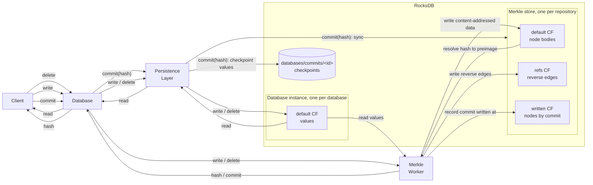

The Merkle Worker speeds up durable storage by taking Merkle tree updates off the critical path.
Writes and deletes return without waiting for the tree, which only blocks the caller when a hash, commit or clone needs it.

Each database in a Registry pairs a [Persistence Layer](/new-durable-storage/persistence-layer), which stores values in RocksDB, with a Merkle Worker, which maintains the database's Merkle tree and its root hash.
The worker runs the tree's Merkle Layer in a background task on the Registry's runtime thread, so tree updates do not block the main thread.

Every write or delete hits both the Persistence Layer and the Merkle Worker.
The main thread applies it to the Persistence Layer immediately, then queues it for the Merkle Worker without blocking.
Reads are served by the Persistence Layer alone.
The tree can therefore lag behind the stored values but the two are expected to be eventually consistent.
Hashing, committing and cloning are synchronisation points: they first wait for the worker to apply every queued operation.

The figure above illustrates all flows for durable storage operations on a single database, showing how each interacts with both the Merkle Worker and the persistence layer.
The table below gives more details for each type of operation illustrated, showing what runs in the main thread and what runs in the runtime thread.
The main thread owns the Registry and performs all work related to the Persistence Layer. Each database's Merkle Layer lives in a task on the Registry's tokio runtime, which has a single worker thread shared by all tasks.
`PLᵢ` refers to the Persistence Layer for database `i` in the Registry.

| Operation | Main thread | Runtime thread |
|---|---|---|
| `read`, `exists`, `value_length` | Reads `PLᵢ` directly. No message is sent. | Nothing |
| `set`, `write`, `delete` | Writes to `PLᵢ`. Sends a `Command` on the channel and returns at once. | Updates the tree, lazily loading nodes and values through `PLᵢ`. A later `delete` or shorter `set` may already have reached `PLᵢ` when the value is loaded. The load then fails and the key is marked as inconsistent instead of panicking, until the later command restores it. |
| `hash` | Sends a command with a oneshot sender, then blocks on the reply. | Applies the backlog in order, asserts no keys are inconsistent, then replies with the root hash. |
| `copy_database`, `try_clone` | Clones `PLᵢ`, sends `clone_with`, then blocks. Spawns a new task from the returned copy. | Replies with a copy of the Merkle Layer. |
| `commit` | Locks `base`. If the Merkle store has been collected since `base` was recorded, checks that `base` is still in the journal. For each database in turn: reads the next commit sequence number, sends `commit`, blocks, then runs `PLᵢ.commit(repo)`. Finally writes the manifest and records it in the journal. | Asserts no keys are inconsistent. Stores the tree's nodes, through `PLᵢ`, into the repository's [Merkle store](/new-durable-storage/persistence-layer#merkle-nodes), with their reverse edges and the commit they were written at. Skips nodes already stored and writes no values. Then replies with its `CommitId`. |
| `start_proof` | Sends `clone_with`, blocks, then owns the returned layer in `Prove` mode. Proving runs only on the main thread. | Replies with a copy of the `MerkleLayer`. |

All tasks share one runtime thread, so a slow command for one database delays the others. Ordering is guaranteed only within a single database's channel. The main thread waits on the worker only at the synchronisation points: `hash`, `commit`, cloning and starting a proof.
